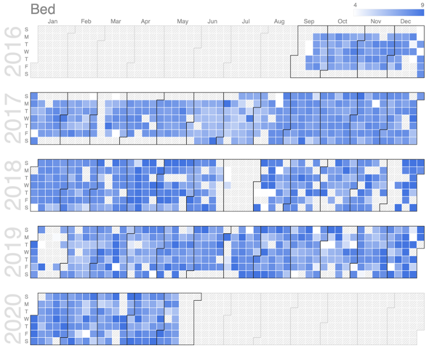

# HealthData

R Script to Analyze and Visualize Health Data

This was a project I did for Intro to Data science. I took data collected from my Apple Watch over the last few years, exported it, and parsed it with this R script, which then analyzed for correlation between different health characteristics. See the powerpoint pdf for more information.